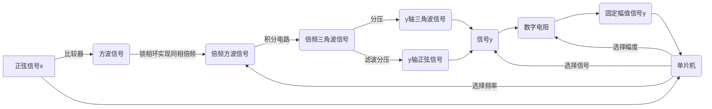

## lab9_Lissajous_Figures

#### 实验要求

设计并实现李萨如（Lissajous）图形演示装置，如图 1 所示。输入正弦信号作为 x 轴 信号，其峰峰值 2V，频率 1.5kHz~2kHz；对输入的正弦信号进行幅度和频率变换后产生 y 轴信号；装置显示器上显示对应的李萨如（Lissajous）图形。

1.  y 轴与 x 轴信号频率倍数 1~5 倍程控可调，1 倍步进；频率误差绝对值不大于 100Hz。

2. y 轴信号峰峰值 1V、2V、3V 程控可选，；幅度误差绝对值不大于 0.1V。

3. y 轴正弦信号可转换为相应的三角波信号。 

4. 装置可测量并显示 y 轴与 x 轴信号初始相位差（参见图 1 中 φ），测量误差绝对值不 大于 5°。

5. 装置显示器上显示李萨如（Lissajous）图形。

#### 实验框架

#### 实验材料

| 器件          | 型号           |
| ------------- | -------------- |
| 比较器        | LM339          |
| 锁相环芯片    | CD4046         |
| 分频器/计数器 | SN74HC161N     |
| 运放          | 5个OP07        |
| 数字电阻      | TPL0401A       |
| 单片机        | MSP432，串口屏 |
| 仪表放大器    | INA128         |

TPL0401A:

> TPL0401x-10器件是一个单通道线性锥度数字电位器，具有128个雨刷位置。TPL0401x-10的默认上电状态为中码(0×40)。TPL0401x-10内部低端接GND。雨刷的位置可以通过i2c接口进行调整。TPL0401x-10采用6引脚SOT封装，指定温度范围为-40°C至+125°C。该部件具有10-kΩ端到端电阻，可以在2.7 V至5.5 V的电源电压范围内工作。该产品广泛用于低功耗DDR3存储器的基准电压设定。TPL0401x-10低端在内部，接GND

#### 实验进度

问题记录：CD4046锁相环模块，有最小工作频率，需要调节环路滤波器的电容值，以实现要求，原理不明。

| C1(F) | C2(F) | 最小工作频率（输出信号的频率）(Hz) |
| ----- | ----- | ---------------------------------- |
| 470n  | 2*1u  | 7.68k                              |
| 470n  | 1u    | 8k                                 |
| 470n  | 0.1u  |                                    |

##### 5.19日实验记录

CD4046也有输入信号电压的要求，一旦不满足上述条件电压频率工作条件，输出信号频率就会截至某一定值，即使没有信号输入。（没有烧掉真是太好了）

结论，在无信号输入时，可以检测到它输出一定频率f0，峰峰值4.7V左右的方波信号，这个频率应该就是最低工作频率。现在我要调节不同的电容值，看看它会怎么变化。

实验结果是似乎没有太大变化，而且频率调节不是很好。。。

##### 7月3日实验记录

最后只能认为环路滤波器对最低工作频率没有主要的影响，因此关键应该是调节VCO的频率范围，它被11、12脚的接地电阻，6、7脚之间的电容所决定。

其中$R_3$是11脚接地电阻，$R_4$是12脚接地电阻。确定电阻值是还要留出一定的安全余量。

其中环路滤波器的参数大致如上，$R_1$是引脚3和9之间的电阻，$R_2$、$C_2$是9脚与地之间的阻抗。

另外161计数器没有坏，但还是又申请了一个。

##### 7月4日实验记录

为LM339的正弦波转方波模块增加一个二极管简单整流实现了勉强的方波输出，经过锁相环倍频电路后可以较好的输出要求频率 的方波了。

设计并制作了方波转三角波电路，关键是输入的方波要进行直流偏置，输出的三角波直流偏置可通过电位器调节。经过实验联调，输出的三角波峰峰值约为880mV。

三角波转正弦波，还需要进行有源滤波，这两者之间需要一个4路选择。

AD放大电路采用INA128。

软件组致力于STM的ADC双通道DMA。
